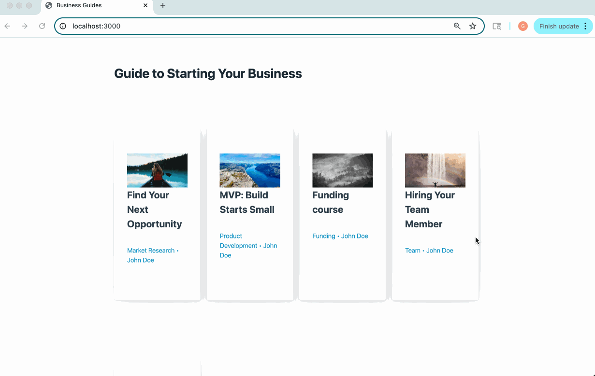

# WEB103 Project 1 - Business Guides

Submitted by: Gulzira Abdullah

About this web app: Business Guides is a web app that helps people learn how to start and grow a business. You can browse guides on topics like product ideas, funding, and sales.

Time spent: 3 hours

## Required Features

The following **required** functionality is completed:

<!-- Make sure to check off completed functionality below -->
- [X] **The web app uses only HTML, CSS, and JavaScript without a frontend framework**
- [X] **The web app displays a title**
- [X] **The web app displays at least five unique list items, each with at least three displayed attributes (such as title, text, and image)**
- [X] **The user can click on each item in the list to see a detailed view of it, including all database fields**
  - [X] **Each detail view should be a unique endpoint, such as as `localhost:3000/bosses/crystalguardian` and `localhost:3000/mantislords`**
  - [X] *Note: When showing this feature in the video walkthrough, please show the unique URL for each detailed view. We will not be able to give points if we cannot see the implementation* 
- [X] **The web app serves an appropriate 404 page when no matching route is defined**
- [X] **The web app is styled using Picocss**

The following **optional** features are implemented:

- [ ] The web app displays items in a unique format, such as cards rather than lists or animated list items

The following **additional** features are implemented:

- [ ] List anything else that you added to improve the site's functionality!

## Video Walkthrough

**Note: please be sure to 

Here's a walkthrough of implemented required features:

<!-- Replace this with whatever GIF tool you used! -->
GIF created with LICEcap
<!-- Recommended tools:
[Kap](https://getkap.co/) for macOS
[ScreenToGif](https://www.screentogif.com/) for Windows
[peek](https://github.com/phw/peek) for Linux. -->

## Notes

Overall it was a great practice to create both client and server side of the application and one challenging part is to JavaScript implement part, it was hard to implement since JS is not the language that I am used to.

## License

Copyright [2025] [Gulzira Abdullah]

Licensed under the Apache License, Version 2.0 (the "License"); you may not use this file except in compliance with the License. You may obtain a copy of the License at

> http://www.apache.org/licenses/LICENSE-2.0

Unless required by applicable law or agreed to in writing, software distributed under the License is distributed on an "AS IS" BASIS, WITHOUT WARRANTIES OR CONDITIONS OF ANY KIND, either express or implied. See the License for the specific language governing permissions and limitations under the License.
